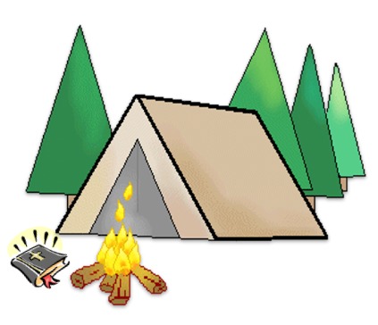
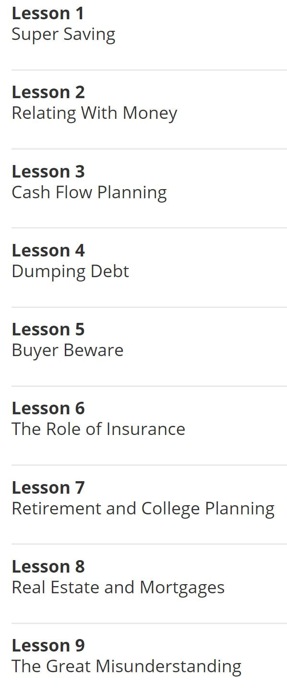

[ EVERGREEN COMMUNITY CHURCH ](index.html)

  * [ REGULAR MEETINGS ](index.html)
  * [ WHO WE ARE ](who-we-are.html)
  * [ WHAT WE BELIEVE ](what-we-believe.html)
  * [ FIND US ](find-us.html)
  * [ EVENTS ](events.html)
  * [ SERMONS ](sermons.html)

    * [ LIBRARY  ](library.html)

  * [ CALENDAR ](calendar.html)
  * [ CONTACT US ](contact-us.html)

  
  
---  
  
##  
​ **UPCOMING EVENTS**

​

**Evergreen Women's Retreat   ** **" _Made for Relationship_ " **  
Williamsburg Retreat Center,  October 18-20  
​We hope everyone will come for this special time  
of fellowship, worship, and learning!  
Go to our [Registration Page](https://evergreenpowhatan.us14.list-
manage.com/track/click?u=94377799bbf85361c32bc6d2f&id=b1de8486ad&e=76a60db91f)
for more information  
​and to sign up!  
For questions, please contact [Sheila
Kendricken](mailto:skendricken@gmail.com),  [Jeni
O'Neill](mailto:jeni_oneill@me.com) or [Christy
Conner](mailto:koolconner4@gmail.com).

* * *

  
**​ Love to dance?**  
Come to our next Community Barn Dance Mission Fundraiser on Friday, September
20, 6:30-9:30 PM at the Powhatan War Memorial Building!  
Net proceeds go to support MNA disaster relief.  
Really special offer for first timers!  
Directions [here](https://goo.gl/maps/3oAR3gX9oY4TDtj66) \- tickets below!

* * *

[Get Tickets](https://egpca.ticketspice.com/evergreen-community-dance-2019)

* * *

## **PAST EVENTS**

  
**​ Saturday  |  August 24  |  6-9 PM**  
  
Join us for hot dogs, marshmallows, music,  
fun, and fellowship with friends!  
​Address:  2895 Lower Hill Road  
  

* * *

|

|

> **Evergreen Ladies' Tea and Fellowship**  
>  
>  Join us for a special time of prayer and fellowship.  
>  
> July dates:  
> Wednesday, July 10, 9:30 AM  
> Amy Wenger hosting  
>  
> Wednesday, July 24, 7:00 PM  
> Suzanne Mehfoud hosting  
  
---|---  
  

VACATION BIBLE SCHOOL  
Upward Bound - Hear from Eyewitnesses !  
Evening Activities and Lessons  >  ​Tuesday, June 18th to Friday, June 21st  
Drop off  > 6:15pm  
Program runs from > 6:30pm to 8:30pm  
Location > 3308 Pleasants Road, Powhatan (map below)  
(In the Powhatan Christian Fellowship Building and Sanctuary)  
Registration _**[here](https://form.jotform.com/91417311203140)**_ < click!

* * *

** ** POT LUCK AND GAME NIGHT  
  
Bring games and food to share,  
or just come along !  
2200 Cedarwood Rd, Powhatan.  
SATURDAY EVENING | FEBRUARY 16 |  6:00 pm to 9:00 pm  
  

* * *

* * *

WINTER  DANCE !  
(This was so much fun we'll do it again, soon!)  
We'll be having a Winter Barn Dance again!  
Come and join us, at the War Memorial Hall in Powhatan  
More details [here](https://www.facebook.com/events/395606410978438/) on the
facebook event  
 SATURDAY    |    JANUARY   26   |  1:30 pm  -  5:00 pm

* * *

* * *

  
POWHATAN CHRISTMAS PARADE !  
Beginning at _Powhatan_  Elementary School, the parade features a procession
of floats, fire engines, antique cars, horses and representation from just
about every organization in Powhatan.  
The parade ends with Santa at the Courthouse Square lawn.  
​The Evergreen float will be in the  procession!  
​COME AND JOIN THE FUN!  
 SATURDAY  |  DECEMBER 8   |  2pm-5pm  
  

* * *

## EVERGREEN BIBLE CAMP !  
​HEAR FROM BIBLE CHARACTERS  |  LEARN WOOD CRAFTS  
ENJOY GAMES  AND  SONGS  
OF COURSE > SNACKS AND CAMPFIRE!

7,8 & 9 AUGUST '18  |  EVENING PROGRAM  |  6:30PM TO 9:00PM  
AT '[THE COOP](find-us.html)' < CLICK FOR DIRECTIONS  
​ OPEN FOR AGES 9 to 11 - REGISTER ON THIS
[FORM](uploads/1/1/7/9/117912857/registration_form_bible_camp.docx)  
SPACE IS LIMITED SO REGISTER SOON!

* * *

## FINANCIAL PEACE COURSE  
WE HOPE TO RUN THIS AGAIN !  
​IF YOU ARE INTERESTED  
[CONTACT US!](contact-us.html)

|

**This Course ​runs on a convenient weekday  evening  for 10 weeks.  
_When you are registered you get all material and online video links for past
meetings!_**  
 **Location:**  
At "​ _[The Coop](find-us.html)_ " <\- click here for a map  
​For general information about this program click
[here.](https://www.daveramsey.com/)

|

  
  
---|---|---  
  
* * *

## SEDAR MEAL | Saturday  |  24 MARCH 2018 |  6:00pm

  
  
|

|  
  
---|---  
  
Proudly powered by [Weebly](https://egpca.weebly.com/_blank)  
  
  * [ REGULAR MEETINGS ](index.html)
  * [ WHO WE ARE ](who-we-are.html)
  * [ WHAT WE BELIEVE ](what-we-believe.html)
  * [ FIND US ](find-us.html)
  * [ EVENTS ](events.html)
  * [ SERMONS ](sermons.html)

    * [ LIBRARY  ](library.html)

  * [ CALENDAR ](calendar.html)
  * [ CONTACT US ](contact-us.html)

