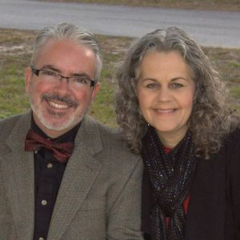

Our Pastor, Robert Barnes:  
The pastor at ECC is Robert Barnes. Born in New Orleans and raised on a farm
in Prentiss, Miss., Robert attended [Belhaven
University](http://www.belhaven.edu/) and then moved to Winter Park, FL. There
he served at Howell Branch Fellowship (PCA) and met a beautiful woman in a red
dress who quickly realized this country hick needed a wife. They were married
and Robert attended seminary at [Reformed Theological
Seminary](https://www.rts.edu/orlando/) in Orlando, Florida.  After completing
his degree, for the next 15 years, Robert worked as a musician in the church
and a writer and editor with [Ligonier Ministries](http://ligonier.org/),
[Third Millennium Ministries](http://thirdmill.org/), [CRU](http://cru.org/)
and worked on the Discover God Study Bible and the ESV Study Bible projects.
In 2007, Robert was in Liberia, Africa doing mission work with [Equipping
Leaders International](https://equippingleadersinternational.org/) when he
received a call from a search committee at Dayspring PCA to consider being
their pastor. In June of 2019, ECC installed Robert as their new pastor,
following Leonard Lui's ten successful years as the church planter. In
addition to pastoral responsibilities, he enjoys music, reading, and the
beauty of God's creation (fishing!). Especially with his dear wife, Kim.  
Robert and Kim have two adult children, Bethany and Noah, who are at
[Reformation Bible College. ](http://reformationbiblecollege.com/)  

* * *

* * *

